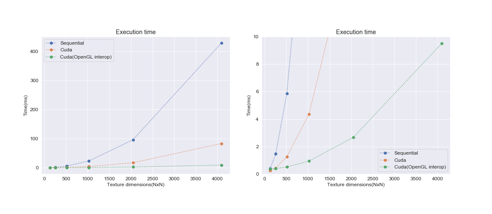
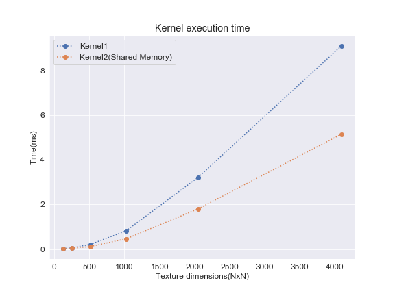

# Cellular Automata CUDA+OpenGL

Parallel implementation of 2d cellular automata using Cuda and OpenGL. It requires cuda, glew and freeglut installed. 

$ make  
$ ./program.exe [rule] [size] [execution_mode]

- Rule number is a decimal specifying the cellular automata that will be simulated. https://www.conwaylife.com/wiki/Rule_integer  
- The total number of simulated cells is size x size. 
- Execution mode can be "cpu" (sequential cpu version), "cuda" or "fullcuda" (interop between opengl and cuda using cuda surfaces to update the texture in the gpu).

Rule 6152 (Game of life):  

Rule 242120 (Day Night):  

Performance on a 1660 ti max-q + i5-9300H (average execution time in miliseconds per simulation step / iteration):  

  

The speed of the simulation is set to 50 ms between steps, so the program can simulate a total of 81*10^6 cells (at an average of 49 ms) before it starts to slow down the simulation.